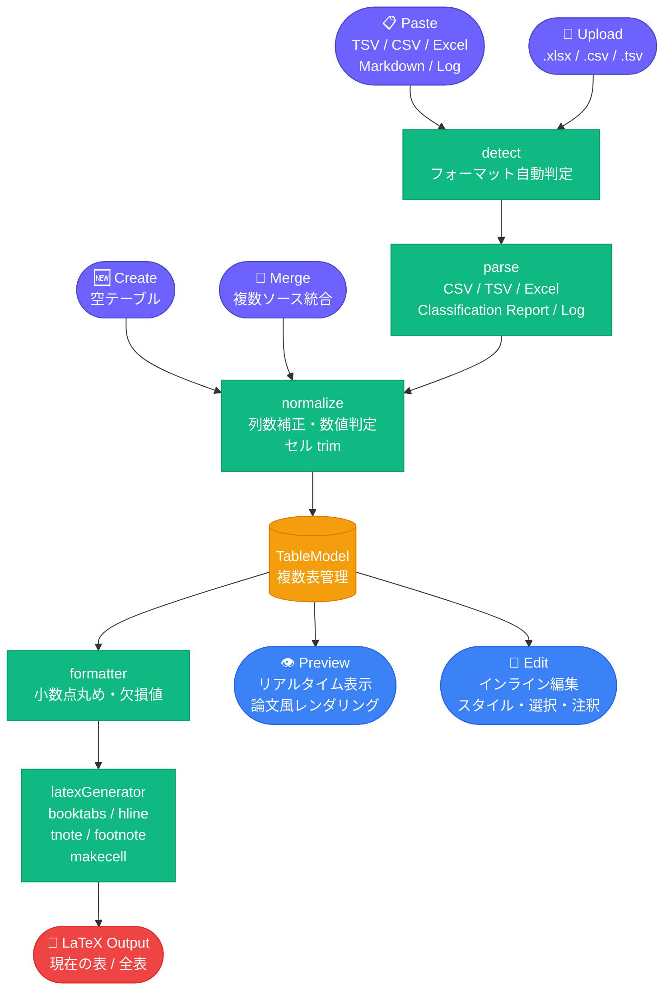
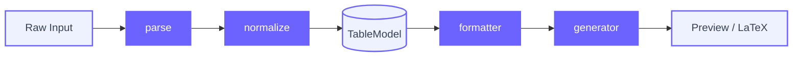
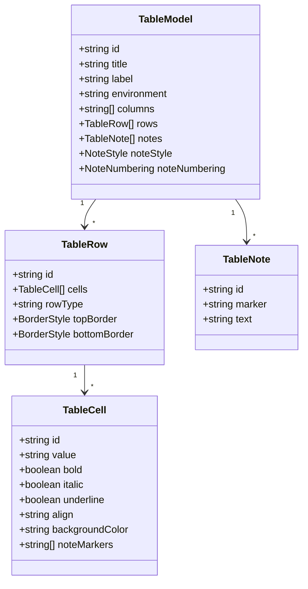
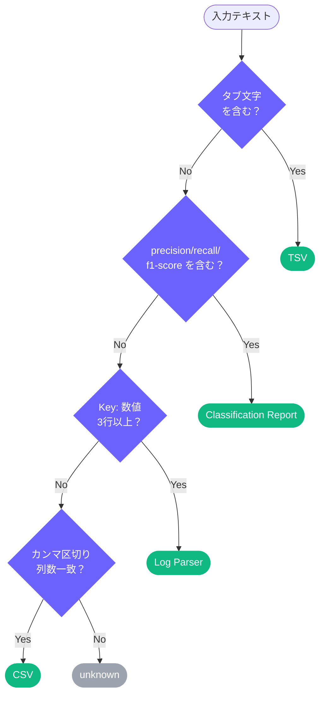

# LaTeX Table Composer

**表データを論文向け LaTeX に変換・整形するツール**

[](https://reactjs.org/)
[](https://www.typescriptlang.org/)
[](https://vitejs.dev/)
[](https://tailwindcss.com/)
[](LICENSE)

---

## 概要

研究・論文作成における **「表の LaTeX 化」** を自動化する Web アプリケーション。

Excel・Google Sheets のコピー、CSV ファイル、sklearn の classification report、実験ログなど、さまざまな形式のデータを貼り付けるだけで **論文投稿品質の LaTeX コード** を即座に生成します。

```
研究者の従来ワークフロー          LaTeX Table Composer
━━━━━━━━━━━━━━━━━━━━        ━━━━━━━━━━━━━━━━━━━━
Excel で表作成
  ↓                               データを貼り付け or アップロード
手作業で LaTeX 変換   ──→             ↓
  ↓                           リアルタイムプレビューで確認・編集
コンパイルして確認                      ↓
  ↓                           Copy LaTeX ボタン一発でコピー
見た目を修正して再編集
```

バックエンド・データベース不要。ブラウザだけで完結します。

**公開 URL：** https://latex-table-composer.vercel.app/

---

## 課題背景

千葉工業大学 2026年前期「Web3・AI概論」の第6回課題（テーマ：プロトタイプ v2）として作成しました。

**解決したかった問題：**  
研究・論文執筆では Excel の実験結果や Python の出力を LaTeX の表に変換する作業が毎回発生する。手作業での変換はミスが起きやすく、再編集のたびに同じ作業を繰り返す必要がある。

**対象ユーザー：**  
LaTeX で論文を書く学部生・大学院生・研究者。実験結果を論文表に整形したい人。

**一言紹介：**  
貼り付けるだけで論文向け LaTeX 表が生成される、研究者のための表変換ツール。

---

## 主な機能

### 入力方式

| モード | 対応形式 |
|--------|---------|
| **Paste** | TSV / CSV / Excel コピー / Google Sheets / Markdown テーブル / LLM 出力 |
| **Upload** | `.csv` / `.tsv` / `.txt` / `.xlsx` / `.xls` |
| **Create** | 空テーブルをゼロから作成（Quick presets: 2×2, 3×3, 4×4, 5×3） |
| **Merge** | 複数ソースの統合（行追加 / 列追加 / 置換） |

### 編集機能（Edit モード）

- **セル直接編集**（インライン）
- **セル内改行**：Shift+Enter で改行。プレビューに反映、LaTeX では `\makecell{line1 \\ line2}` を自動出力
- **行・列の追加・削除**（途中挿入対応）
- **スタイル編集**：太字 / 斜体 / 下線 / 背景色 / 揃え
- **範囲選択**：クリック / Shift+クリック（矩形）/ ドラッグ / 行・列まるごと
- **列の表示/非表示**
- **罫線スタイル**：行単位で `\hline` / `\midrule` を設定

### 注釈（Annotation）

- `\tnote{}` / `\footnotemark` 両対応
- 自動採番：アルファベット（a, b, c…）/ 数字（1, 2, 3…）
- `\begin{threeparttable}` を自動で挿入・管理
- **注釈の削除**：注釈を削除すると全セルのマーカーも連動してクリーンアップ
- **セルレベルの detach**（⊘ ボタン）：選択セルから特定マーカーだけ外す（注釈本体は残す）

### Merge（ソース統合）

- **ファイルごとに適用方向を選択**（↓行追加 / →列追加）
- **Apply**：全ソースをリスト順に適用（何度でも押せる）
- **Replace**：1つのソースでテーブル全体を置き換え（ソースはリストに残る）
- **並び替え**：↑↓ ボタンでソースの適用順を変更
- **テーブルをクリア**：🗑 ボタンでメインテーブルを空にしてやり直し

### 複数表の一括管理

- **タブバー**：複数の表を追加・削除・切り替え
- **LaTeX エクスポート**：現在の表のみ / すべての表（テーブルセパレーター付き）を選択してコピー

### 出力設定

- **罫線スタイル**：Default（3線 `\hline`）/ Booktabs（投稿用）/ Full Grid / 上下のみ
- **小数点桁数**：Auto（4桁）/ 0〜4桁
- **欠損値**：`---` / `N/A` / `-` / 空白
- **出力環境**：`table` / `table*`

---

## Screenshot

> **Add screenshot here.**  
> `docs/screenshot.png` を配置後、以下のコメントアウトを解除してください。

<!--  -->

---

## アーキテクチャ



---

## 処理パイプライン詳細



### TableModel（Single Source of Truth）



---

## 出力例

### 入力（TSV 貼り付け）

```
Method	Accuracy	Precision	F1
Ours	0.924	0.918	0.911
BERT	0.901	0.895	0.887
Baseline	0.872	0.864	0.859
```

### 出力（LaTeX）

```latex
% Required Packages:
% \usepackage{booktabs}

\begin{table*}[tb]
\caption{}
\label{}
\begin{center}
\begin{tabular}{lrrr}
\toprule
\textbf{Method} & \textbf{Accuracy} & \textbf{Precision} & \textbf{F1} \\
\midrule
Ours & 0.9240 & 0.9180 & 0.9110 \\
BERT & 0.9010 & 0.8950 & 0.8870 \\
\midrule
Baseline & 0.8720 & 0.8640 & 0.8590 \\
\bottomrule
\end{tabular}
\end{center}
\end{table*}
```

### セル内改行の出力例（`\makecell`）

```latex
% Required Packages:
% \usepackage{booktabs}
% \usepackage{makecell}

\begin{tabular}{ll}
\toprule
\textbf{Model} & \textbf{Notes} \\
\midrule
Ours & \makecell{High accuracy \\ Low latency} \\
\bottomrule
\end{tabular}
```

---

## 対応する自動検出フォーマット



---

## 技術スタック

| カテゴリ | 採用技術 |
|---------|---------|
| フレームワーク | React 18 + TypeScript 5 |
| ビルド | Vite 5 |
| スタイリング | Tailwind CSS 3 + Custom CSS Variables |
| Excel 解析 | SheetJS（xlsx）※ dynamic import |
| AI アシスタント | Claude Code (Anthropic) |
| デプロイ | Vercel |

---

## セットアップ

```bash
# リポジトリをクローン
git clone <repository-url>
cd latex-table-composer

# 依存パッケージをインストール
npm install

# 開発サーバーを起動
npm run dev
# → http://localhost:5173

# ビルド
npm run build
```

---

## ディレクトリ構成

```
src/
├── components/
│   ├── shared/
│   │   └── Toast.tsx              # トースト通知（共有コンポーネント）
│   ├── InputPanel.tsx             # 入力パネル（Paste/Upload/Create/Merge）
│   ├── PreviewPanel.tsx           # プレビュー + 編集（セル内改行・注釈 UI）
│   ├── TableEditorToolbar.tsx     # 編集ツールバー
│   ├── FormattingBar.tsx          # 出力設定
│   └── MergePanel.tsx             # ソース統合（per-source direction 対応）
│
├── lib/
│   ├── theme.ts                   # CSS 変数名定数
│   └── table/
│       ├── types.ts               # TableModel / TableCell / TableNote 型定義
│       ├── parser/                # 各フォーマットのパーサー
│       ├── normalize/             # データ正規化
│       ├── formatters/            # 出力フォーマット設定
│       ├── generators/            # LaTeX 生成（makecell 対応）
│       ├── editor/                # 編集操作（純粋関数）
│       └── merge/                 # マージ操作
│
└── App.tsx                        # アプリケーションルート（複数表管理）

test-data/                         # Merge テスト用サンプルデータ
├── main_table.csv
├── append_rows.csv
├── append_columns.csv
├── replace_target.csv
└── README.md
```

---

## 制限事項

- **Excel の複雑なフォーマット**：結合セルや複数シートには非対応です。1シート・シンプルな表を対象としています。
- **LaTeX 特殊記号**：`&` `%` `$` `#` `_` `{` `}` `\` は自動エスケープされますが、数式等の高度な LaTeX 記法はそのまま入力してください。
- **multirow / multicolumn**：セル結合には対応していません（将来対応予定）。
- **大規模テーブル**：100行 × 20列程度を想定。それ以上はパフォーマンスが低下することがあります。

---

## Version History

| Version | Focus | 主な追加機能 |
|---|---|---|
| v1 | 基本変換パイプライン | プロジェクト初期セットアップ / フォーマット自動検出（TSV・CSV・Classification Report・Log）/ Normalize / HTML プレビュー / LaTeX ジェネレーター（booktabs 対応）/ 出力設定（小数点・欠損値・罫線・環境）|
| v2 | 編集・統合・注釈 | Edit モード（インライン編集・行列追加削除・途中挿入）/ 選択＆スタイル編集（太字・斜体・下線・背景色・揃え）/ 列の表示/非表示 / XLSX 対応 / Merge（行追加・列追加・置換）/ Caption・Label / 範囲選択（矩形・行列一括）/ 注釈（`\tnote` / `\footnotemark`・自動採番）|
| v3 | 注釈改善・改行・複数表・UX 改善 | 注釈削除時の全セル markers 連動クリーンアップ / セルレベル detach（⊘ ボタン）/ セル内改行（Shift+Enter → `\makecell`）/ Merge UI 再設計（per-source direction・Apply 複数回・Replace）/ Merge 空テーブル開始（初回 Apply でソース全体を取り込む）/ 複数表タブバー（追加・削除・切り替え）/ 新規タブを空状態で開始（Table preview will appear here）/ 全モード共通クリアボタン（黄色 warn スタイル）/ 全表 LaTeX エクスポート |

---

## Roadmap

- [ ] multirow / multicolumn 対応
- [ ] drag & drop によるセル移動
- [ ] ダークモード
- [x] 複数表の一括管理
- [x] セル内改行（`\makecell` 対応）
- [ ] Citation ⇄ BibTeX Converter への統合

---

## 関連プロジェクト

本プロジェクトは [Citation ⇄ BibTeX Converter](https://github.com/Axe0320/citation-bibtex-converter) の UI 思想・設計哲学を継承し、将来的な統合を前提として開発されました。

---

## 備考

本リポジトリは、千葉工業大学「Web3・AI概論」第6回課題の要件である以下を満たすよう作成しています。

1. AI 支援（Claude Code）を活用したプロトタイプ開発
2. 研究・学習上の実課題を解決するプロダクトの試作
3. GitHub へのソースコード公開
4. Vercel へのデプロイ（予定）

---

## License

[MIT License](LICENSE)
