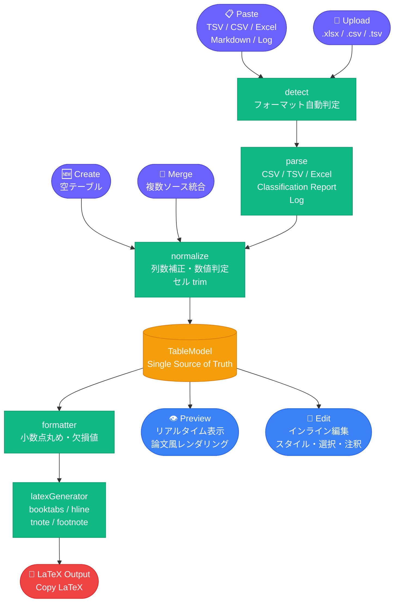
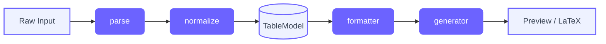
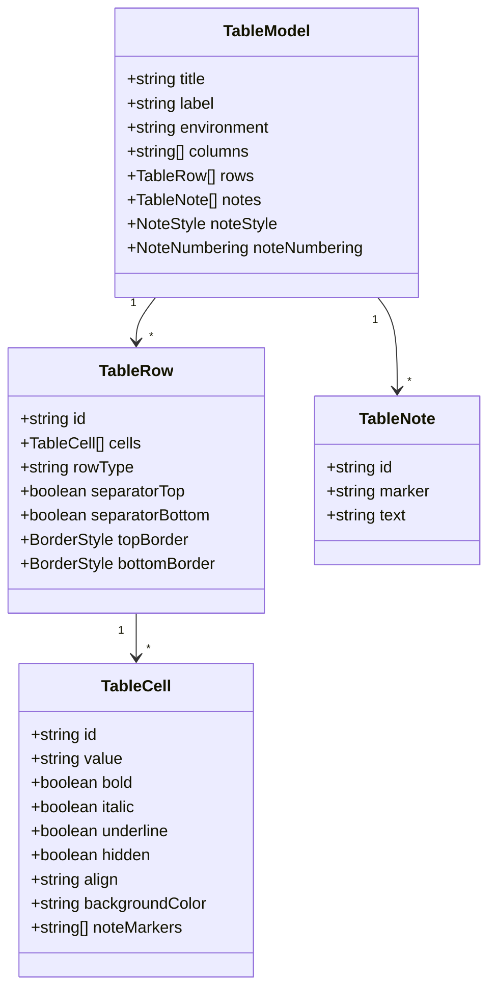

# LaTeX Table Composer

**表データを論文向け LaTeX に変換・整形するツール**

> 千葉工業大学「Web3・AI概論」第6回課題 — プロトタイプ v2

[](https://reactjs.org/)
[](https://www.typescriptlang.org/)
[](https://vitejs.dev/)
[](https://tailwindcss.com/)

---

## 概要

研究・論文作成における **「表の LaTeX 化」** を自動化する Web アプリケーション。

Excel・Google Sheets のコピー、CSV ファイル、sklearn の classification report、実験ログなど、さまざまな形式のデータを貼り付けるだけで **論文投稿品質の LaTeX コード** を即座に生成します。

```
研究者の従来ワークフロー          LaTeX Table Composer
━━━━━━━━━━━━━━━━━━━━        ━━━━━━━━━━━━━━━━━━━━
Excel で表作成
  ↓                               データを貼り付け or アップロード
手作業で LaTeX 変換   ──→             ↓
  ↓                           リアルタイムプレビューで確認・編集
コンパイルして確認                      ↓
  ↓                           Copy LaTeX ボタン一発でコピー
見た目を修正して再編集
```

---

## 主な機能

### 入力方式

| モード | 対応形式 |
|--------|---------|
| **Paste** | TSV / CSV / Excel コピー / Google Sheets / Markdown テーブル / LLM 出力 |
| **Upload** | `.csv` / `.tsv` / `.txt` / `.xlsx` / `.xls` |
| **Create** | 空テーブルをゼロから作成（Quick presets: 2×2, 3×3, 4×4, 5×3） |
| **Merge** | 複数ソースの統合（行追加 / 列追加 / 置換） |

### 編集機能（Edit モード）

- **セル直接編集**（インライン）
- **行・列の追加・削除**（途中挿入対応）
- **スタイル編集**：太字 / 斜体 / 下線 / 背景色 / 揃え
- **範囲選択**：クリック / Shift+クリック（矩形）/ ドラッグ / 行・列まるごと
- **列の表示/非表示**
- **罫線スタイル**：行単位で `\hline` / `\midrule` を設定

### 出力設定

- **罫線スタイル**：Default（3線 `\hline`）/ Booktabs / Full Grid / 上下のみ
- **小数点桁数**：Auto（4桁）/ 0〜4桁
- **欠損値**：`---` / `N/A` / `-` / 空白
- **出力環境**：`table` / `table*`

### 注釈（PR-15C）

- `\tnote{}` / `\footnotemark` 両対応
- 自動採番：アルファベット（a, b, c…）/ 数字（1, 2, 3…）
- `\begin{threeparttable}` を自動で挿入・管理

---

## アーキテクチャ



---

## 処理パイプライン詳細



### TableModel（Single Source of Truth）



---

## 出力例

### 入力（TSV 貼り付け）

```
Method	Accuracy	Precision	F1
Ours	0.924	0.918	0.911
BERT	0.901	0.895	0.887
Baseline	0.872	0.864	0.859
```

### 出力（LaTeX）

```latex
% Required Packages:
% \usepackage{booktabs}

\begin{table*}[tb]
\caption{}
\label{}
\begin{center}
\begin{tabular}{lrrr}
\toprule
\textbf{Method} & \textbf{Accuracy} & \textbf{Precision} & \textbf{F1} \\
\midrule
Ours & 0.9240 & 0.9180 & 0.9110 \\
BERT & 0.9010 & 0.8950 & 0.8870 \\
\midrule
Baseline & 0.8720 & 0.8640 & 0.8590 \\
\bottomrule
\end{tabular}
\end{center}
\end{table*}
```

---

## 対応する自動検出フォーマット


---

## 技術スタック

| カテゴリ | 採用技術 |
|---------|---------|
| フレームワーク | React 18 + TypeScript 5 |
| ビルド | Vite 5 |
| スタイリング | Tailwind CSS 3 + Custom CSS Variables |
| Excel 解析 | SheetJS（xlsx）※ dynamic import |
| デプロイ | Vercel |

---

## セットアップ

```bash
# リポジトリをクローン
git clone <repository-url>
cd latex-table-composer

# 依存パッケージをインストール
npm install

# 開発サーバーを起動
npm run dev
# → http://localhost:5173

# ビルド
npm run build
```

---

## ディレクトリ構成

```
src/
├── components/
│   ├── InputPanel.tsx        # 入力パネル（Paste/Upload/Create/Merge）
│   ├── PreviewPanel.tsx      # プレビュー + 編集
│   ├── TableEditorToolbar.tsx # 編集ツールバー
│   ├── FormattingBar.tsx     # 出力設定
│   └── MergePanel.tsx        # ソース統合
│
├── lib/table/
│   ├── types.ts              # TableModel / TableCell / TableNote 型定義
│   ├── parser/               # 各フォーマットのパーサー
│   │   ├── detect.ts
│   │   ├── parseCSV.ts
│   │   ├── parseTSV.ts
│   │   ├── parseClassificationReport.ts
│   │   ├── parseLog.ts
│   │   └── parseExcel.ts
│   ├── normalize/            # データ正規化
│   ├── formatters/           # 出力フォーマット設定
│   ├── generators/           # LaTeX 生成
│   │   └── latexGenerator.ts
│   ├── editor/               # 編集操作（純粋関数）
│   └── merge/                # マージ操作
│
└── App.tsx                   # アプリケーションルート
```

---

## 関連プロジェクト

本プロジェクトは [Citation ⇄ BibTeX Converter](https://github.com/Axe0320/citation-bibtex-converter) の UI 思想・設計哲学を継承し、将来的な統合を前提として開発されました。

---

## 課題情報

| 項目 | 内容 |
|------|------|
| 大学 | 千葉工業大学 |
| 科目 | Web3・AI概論 |
| 回 | 第6回 |
| 課題 | プロトタイプ v2 の作成 |

---

## License

MIT
